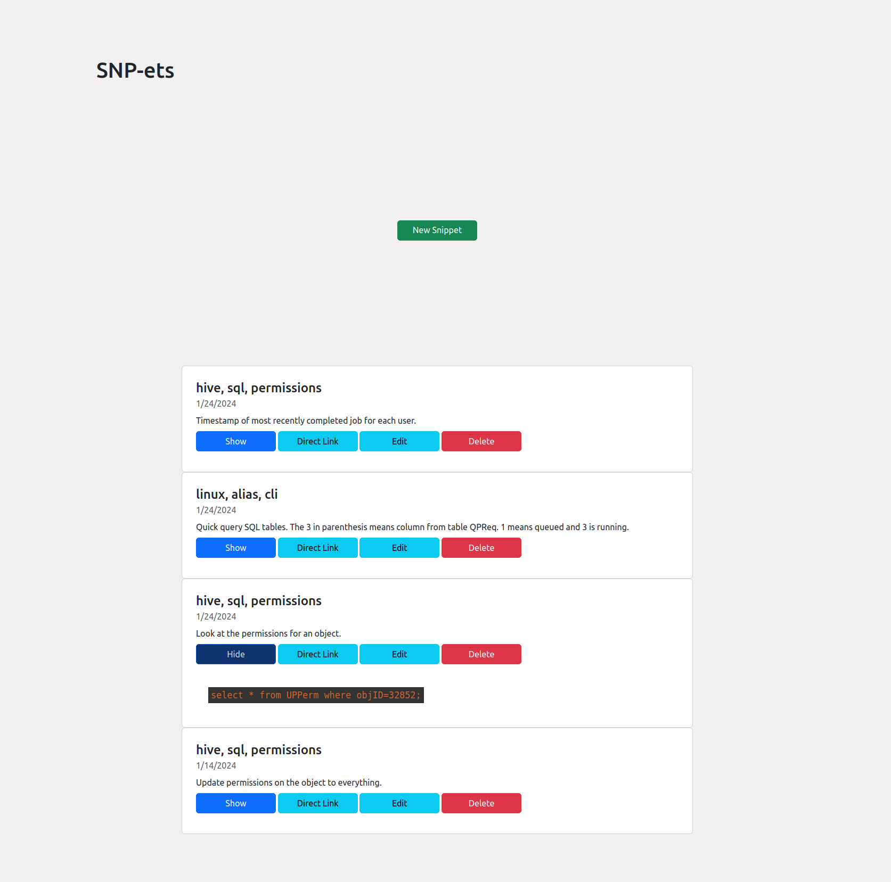

# Code Notebook

This project is a simple MongoDB-based web app for recording helpful commands. Many of the existing tools I tried didn't do what I wanted or were too expensive. This simple, straightforward tool records commands and snippets you find useful, though which may not necessarily warrant their own alias (and which might be hard to keep track of as an alias anyway).

<p align="center">
  
</p>

Project uses 
## To run:
1) Install express (application framework) and ejs (templating tool to generate html from plain JavaScript (view engine)):  
`npm install express ejs`

2a) Install nodemon (optional; automatically restarts the node.js server whenever a change is saved in the project directory):  
`npm install nodemon --save-dev`

2b) Add this line to package.json:  
`"start": "nodemon app.js"`

(Full JSON should look something like this):  
```
{
  "name": "Learning NodeJS",
  "version": "1.0.0",
  "description": "NodeJS Tutorial",
  "main": "index.js",
  "scripts": {
    "test": "echo \"Error: no test specified\" && exit 1",
    "start": "nodemon app.js"
  },
  "author": "",
  "license": "ISC",
  "dependencies": {
    "ejs": "^3.1.3",
    "express": "^4.17.1"
  },
  "devDependencies": {
    "nodemon": "^2.0.4"
  }
}
```

3) Save everything and run it:  
`npm start`

Navigate to http://localhost:5001 in your browser and you should be able to see the project.
Change the port in app.js (`const port = 5001`) to whatever you like if you prefer a different port number.

I may have used `npm init` at some point, I can't remember if it was part of this project or not.

Note that the mongod.conf file is here for reference. It belongs in the /etc/ directory.

There is a launch script ("techNote.sh") to launch it locally (or wherever) once it's set up. The directory is hard coded from the virtual environment that was used to develop the project. Replace it with whatever you want.

